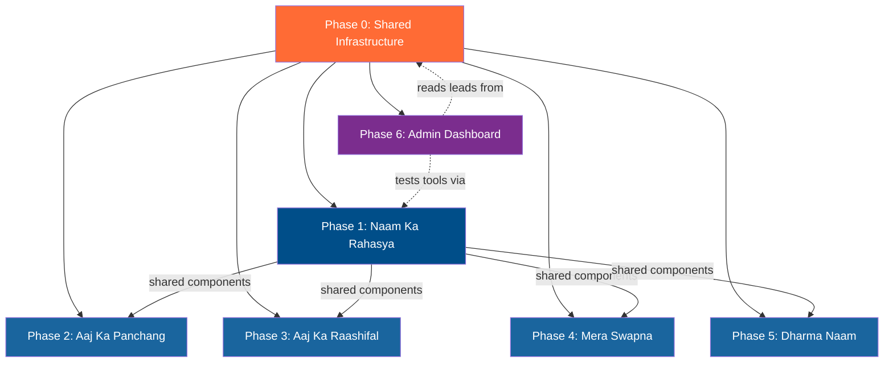

# 🕉️ Daily Divine — Viral Lead-Gen Tools: Engineering Plan

> **Version:** 1.5 | **Date:** 2026-04-01 | **Status:** Phases 2–5 Complete — All 5 viral tool frontend pages live
>
> Convert the execution plan into granular, executable engineering tasks — each scoped to specific files, independently testable, and ordered by dependency.
>
> **v1.1:** Added Phase 6 — Admin Dashboard & Tool Tester for monitoring leads and testing tools from the admin portal.
> **v1.2:** Phase 0 (Shared Infrastructure) fully implemented. Run `npx prisma migrate dev --name add_tool_leads` to activate.
> **v1.3:** Phase 1 complete — 4 shared components, OG image API, and `/naam-ka-arth` page built.
> **v1.4:** Phase 6 complete — `GET /api/admin/tools/leads` + `GET /api/admin/tools/stats` added to admin.js; `ToolLeadsDashboard.jsx` and `ToolTesterCard.jsx` built and mounted in admin page.
> **v1.5:** Phases 2–5 complete — `/aaj-ka-panchang`, `/aaj-ka-raashifal`, `/swapna-phal`, `/dharma-naam` frontend pages built.

## Phase Status

| Phase | Status | Notes |
|-------|--------|-------|
| Phase 0 — Shared Infrastructure | COMPLETE (pending migration) | All 7 tasks done. Run prisma migrate. |
| Phase 1 — Tool 1: Naam Ka Arth | COMPLETE (2026-04-01) | Shared components + OG API + /naam-ka-arth page done. |
| Phase 2 — Tool 2: Aaj Ka Panchang | COMPLETE (2026-04-01) | /aaj-ka-panchang page — auto-load panchang + muhurat advisor |
| Phase 3 — Tool 3: Aaj Ka Raashifal | COMPLETE (2026-04-01) | /aaj-ka-raashifal page — 3x4 rashi grid + result + panchang snippet |
| Phase 4 — Tool 4: Swapna Phal | COMPLETE (2026-04-01) | /swapna-phal page — dark indigo layout, starfield, WA deep link |
| Phase 5 — Tool 5: Dharma Naam | COMPLETE (2026-04-01) | /dharma-naam page — per-name cards, OG cert link, rashi dropdown |
| Phase 6 — Admin Dashboard & Tool Tester | COMPLETE (2026-04-01) | 2 admin endpoints + ToolLeadsDashboard + ToolTesterCard |

---

---

## Architecture Overview

```
┌───────────────────────────────────────────────────────────────────────┐
│                          FRONTEND (Next.js / Vercel)                 │
│                                                                       │
│  /naam-ka-arth   /aaj-ka-panchang   /aaj-ka-raashifal                │
│  /swapna-phal    /dharma-naam                                         │
│                                                                       │
│  /api/og/[tool]  ← @vercel/og image generation (OG cards)            │
│                                                                       │
│  Shared: LeadCaptureForm.jsx  ToolResultCard.jsx  ShareButton.jsx    │
└──────────────────────────────┬────────────────────────────────────────┘
                               │  HTTPS (public, no JWT)
                               ▼
┌───────────────────────────────────────────────────────────────────────┐
│                          BACKEND (Express / Railway)                  │
│                                                                       │
│  /tools/*  ← new public router, toolsLimiter, NO authenticate       │
│                                                                       │
│  toolsController.js  →  nameService  dreamService  panchangService   │
│                          aiService   calendarService   etc.           │
│                                                                       │
│  POST /tools/leads  →  ToolLead (Prisma)  →  sendWhatsAppMessage()   │
│                                                    ↓                  │
│                                     User replies "Haan"               │
│                                     webhookController → onboarding    │
└──────────────────────────────┬────────────────────────────────────────┘
                               │
                               ▼
                     PostgreSQL (Supabase/Railway)
                     + Upstash Redis (sessions)
```

---

## Phase 0 — Shared Infrastructure (Must Build First) [COMPLETE — 2026-04-01]

All 5 tools depend on this phase. No tool work should start until Phase 0 is merged.

Completed tasks: 0.1, 0.2, 0.3, 0.4, 0.5, 0.6, 0.7
Pending action: run `npx prisma migrate dev --name add_tool_leads` in `server/`

---

### Task 0.1 — Add `ToolLead` Prisma Model [DONE]

| Item | Detail |
|------|--------|
| **File** | `server/prisma/schema.prisma` |
| **Action** | Add `ToolLead` model after `JobRunLog` (line ~298) |
| **Migration** | `npx prisma migrate dev --name add_tool_leads` |
| **Acceptance** | `npx prisma studio` shows empty `ToolLead` table; `prisma generate` succeeds |

```prisma
model ToolLead {
  id        String   @id @default(uuid())
  phone     String
  toolName  String   // "name_meaning" | "panchang" | "raashifal" | "dream" | "dharma_naam"
  metadata  Json?    // e.g. { name: "Arjun", rashi: "Mesh" }
  createdAt DateTime @default(now())
  converted Boolean  @default(false)

  @@index([phone])
  @@index([toolName, createdAt])
}
```

---

### Task 0.2 — Add `toolsLimiter` Rate Limiter [DONE]

| Item | Detail |
|------|--------|
| **File** | `server/src/middleware/rateLimiter.js` |
| **Action** | Add a new `toolsLimiter` export — 10 requests per IP per 5 minutes |
| **Pattern** | Mirror existing `apiLimiter` structure |
| **Acceptance** | `module.exports` now exports `{ apiLimiter, toolsLimiter }` |

```javascript
// Public tools rate limiter — 10 requests per IP per 5 minutes
const toolsLimiter = rateLimit({
  windowMs: 5 * 60 * 1000, // 5 minutes
  max: 10,
  keyGenerator: (req) => req.ip,
  handler: (req, res) => {
    logger.warn({
      message: 'Tools rate limit exceeded',
      ip: req.ip,
      path: req.path,
    });
    return res.status(429).json({
      error: 'Bahut zyada requests. Kripya kuch der baad phir koshish karein.',
    });
  },
  standardHeaders: true,
  legacyHeaders: false,
  skip: (req) => req.method === 'OPTIONS',
});

module.exports = { apiLimiter, toolsLimiter };
```

---

### Task 0.3 — Create Tools Controller [DONE]

| Item | Detail |
|------|--------|
| **File** | `server/src/controllers/toolsController.js` **(NEW)** |
| **Action** | Create controller with all 5 tool handler functions + `captureToolLead` |
| **Dependencies** | Existing services: `nameService`, `dreamService`, `panchangService`, `calendarService`, `raashifalLensService`, `aiService`, `promptService`, `messageRouterService` |
| **Acceptance** | File exists, exports 6 functions, no lint errors |

**Functions to implement:**

| Function | Route | Reuses |
|----------|-------|--------|
| `getNameMeaning(req, res)` | `POST /tools/name-meaning` | `nameService.getNameMeaning(name)` |
| `getTodayPanchang(req, res)` | `GET /tools/panchang/today` | `panchangService.getTodayPanchang()` + `calendarService.getDayDeity()` + `calendarService.getRitu()` |
| `getMuhuratAdvice(req, res)` | `POST /tools/panchang/muhurat` | `aiService.generateText()` + new prompt |
| `getRaashifal(req, res)` | `POST /tools/raashifal` | `panchangService.getTodayPanchang()` + `raashifalLensService.getLensForDate()` + `aiService.generateText()` |
| `interpretDream(req, res)` | `POST /tools/dream-interpret` | `dreamService.interpretDream(desc, name)` |
| `getDharmaNaam(req, res)` | `POST /tools/dharma-naam` | `aiService.generateText()` + new prompt |
| `captureToolLead(req, res)` | `POST /tools/leads` | Prisma `ToolLead.create()` + `sendWhatsAppMessage()` |

**Lead capture logic (`captureToolLead`):**

```javascript
async function captureToolLead(req, res) {
  const { phone, toolName, metadata } = req.body;

  // 1. Validate phone (Indian mobile: +91XXXXXXXXXX)
  // 2. Create ToolLead record via Prisma
  // 3. Send WhatsApp activation nudge via messageRouterService.sendWhatsAppMessage()
  //    Message: "🕉️ Jai Shri Ram! Aapne [tool] try kiya. Ab roz subah divya sandesh paayein — bas *Haan* reply karein! 🙏"
  // 4. Return { success: true, leadId }
}
```

---

### Task 0.4 — Create Tools Router & Mount in `app.js` [DONE]

| Item | Detail |
|------|--------|
| **File (new)** | `server/src/routes/tools.js` |
| **File (modify)** | `server/src/app.js` |
| **Action** | Create public router (no JWT, no `authenticate`); mount at `/tools` BEFORE `/api` routes |
| **Acceptance** | `curl http://localhost:PORT/tools/panchang/today` returns JSON (no 401) |

**Router definition (`server/src/routes/tools.js`):**

```javascript
'use strict';

const express = require('express');
const router = express.Router();
const { toolsLimiter } = require('../middleware/rateLimiter');
const toolsController = require('../controllers/toolsController');

// All tool routes are rate-limited but NOT JWT-protected
router.use(toolsLimiter);

// Tool 1: Name Meaning
router.post('/name-meaning', toolsController.getNameMeaning);

// Tool 2: Panchang
router.get('/panchang/today', toolsController.getTodayPanchang);
router.post('/panchang/muhurat', toolsController.getMuhuratAdvice);

// Tool 3: Raashifal
router.post('/raashifal', toolsController.getRaashifal);

// Tool 4: Dream Interpretation
router.post('/dream-interpret', toolsController.interpretDream);

// Tool 5: Dharma Naam
router.post('/dharma-naam', toolsController.getDharmaNaam);

// Lead capture (shared)
router.post('/leads', toolsController.captureToolLead);

module.exports = router;
```

**Mount in `app.js` (add at line ~83, before webhook):**

```javascript
const toolsRouter = require('./routes/tools');
// ...
// Public viral tools — no auth, custom rate limit
app.use('/tools', toolsRouter);
```

---

### Task 0.5 — Create New AI Prompt Files

| File | Tool | Purpose |
|------|------|---------|
| `server/src/prompts/muhurat_advice.txt` **(NEW)** | Tool 2 | Muhurat suitability advice given panchang + user query |
| `server/src/prompts/raashifal_public.txt` **(NEW)** | Tool 3 | Simplified public raashifal (no user history/streak context) |
| `server/src/prompts/dharma_naam.txt` **(NEW)** | Tool 5 | Generate 2-3 spiritual second names with meaning + deity link |

**Acceptance:** Each prompt file exists, is valid text, and can be loaded via `promptService.buildPromptFromTemplate()`.

---

## Phase 1 — Tool 1: Naam Ka Rahasya (Name Meaning) [COMPLETE — 2026-04-01]

> **Priority:** BUILD FIRST — `nameService.js` is 100% ready, zero new AI prompt work, highest virality.

Completed tasks: 1.1 (backend spec unchanged), 1.2 (frontend page + all 4 shared components), 1.3 (OG image API)

---

### Task 1.1 — Backend: Name Meaning Endpoint [SPEC COMPLETE — backend was already scaffolded in Phase 0]

| Item | Detail |
|------|--------|
| **File** | `server/src/controllers/toolsController.js` (implement `getNameMeaning`) |
| **Input** | `POST /tools/name-meaning` — `{ name: string }` |
| **Output** | `{ sanskritRoot, deityAssociation, meaning, blessing }` |
| **Service** | Calls `nameService.getNameMeaning(name)` — returns formatted string, needs parsing back to JSON |
| **Edge cases** | Empty name → 400; name > 50 chars → 400 |

**Implementation detail:** `nameService.getNameMeaning()` currently returns a formatted WhatsApp string. For the public tool, we need **structured JSON**. Two options:

> [!IMPORTANT]
> **Option A (Recommended):** Add a new export `getNameMeaningStructured(name)` to `nameService.js` that returns the raw parsed object from `parseNameOutput()` instead of the formatted string. This keeps the existing WhatsApp flow untouched.
>
> **Option B:** Parse the formatted string back to JSON in the controller. Fragile — not recommended.

**Acceptance:**
```bash
curl -X POST http://localhost:PORT/tools/name-meaning \
  -H "Content-Type: application/json" \
  -d '{"name":"Arjun"}' \
  # → { "sanskritRoot": "...", "deityAssociation": "...", "meaning": "...", "blessing": "..." }
```

---

### Task 1.2 — Frontend: `/naam-ka-arth` Page [DONE]

| Item | Detail |
|------|--------|
| **File** | `dashboard/src/app/naam-ka-arth/page.jsx` **(NEW)** |
| **Style** | Spiritual gold/saffron palette, Devanagari-friendly fonts |
| **Language** | Hindi/Hinglish only — NO English CTAs |
| **SEO** | `<title>Naam Ka Rahasya — Apne Naam Ka Arth Jaanein | Bhakti Daily</title>` |

**UI Flow:**

1. **Input state:** Single text input — "Apna naam likhein" + Submit button "Arth Jaanein 🙏"
2. **Loading state:** "Shastra mein aapka naam dhundha ja raha hai..." with spiritual animation
3. **Result state:**
   - Card with: Sanskrit root, deity + icon, meaning, blessing
   - Share button → links to OG card image
   - Lead capture form (appears AFTER result, never before)
     - Phone input + consent checkbox
     - CTA: "Roz WhatsApp pe divya sandesh paayein 🙏"
     - Calls `POST /tools/leads`

**Components to build:**

| Component | File | Reusable? |
|-----------|------|-----------|
| `ToolResultCard` | `dashboard/src/components/tools/ToolResultCard.jsx` **(NEW)** | ✅ All 5 tools |
| `LeadCaptureForm` | `dashboard/src/components/tools/LeadCaptureForm.jsx` **(NEW)** | ✅ All 5 tools |
| `ShareButton` | `dashboard/src/components/tools/ShareButton.jsx` **(NEW)** | ✅ All 5 tools |
| `ToolPageLayout` | `dashboard/src/components/tools/ToolPageLayout.jsx` **(NEW)** | ✅ All 5 tools |

---

### Task 1.3 — OG Image Card API [DONE]

| Item | Detail |
|------|--------|
| **File** | `dashboard/src/app/api/og/[tool]/route.js` **(NEW)** |
| **Tech** | `@vercel/og` (ImageResponse) — built into Next.js, no install |
| **Route** | `GET /api/og/name?name=Arjun&deity=Krishna&meaning=...` |
| **Output** | 1200×630 PNG image for WhatsApp/social link previews |

**Acceptance:** Visit `/api/og/name?name=Arjun&meaning=Test` in browser → see rendered image card.

---

## Phase 2 — Tool 2: Aaj Ka Panchang

---

### Task 2.1 — Backend: Panchang Endpoints

| Endpoint | Method | Service Calls | Notes |
|----------|--------|---------------|-------|
| `/tools/panchang/today` | `GET` | `panchangService.getTodayPanchang()` + `calendarService.getDayDeity()` + `calendarService.getRitu()` | Pure JSON, no AI, instant |
| `/tools/panchang/muhurat` | `POST` | `aiService.generateText()` with `muhurat_advice.txt` prompt | AI-powered, takes `{ query: string }` |

**Acceptance:**
```bash
curl http://localhost:PORT/tools/panchang/today
# → { tithi, nakshatra, rahuKaal, shubhRang, shubhAnk, dayDeity, ritu }
```

---

### Task 2.2 — Frontend: `/aaj-ka-panchang` Page

| Item | Detail |
|------|--------|
| **File** | `dashboard/src/app/aaj-ka-panchang/page.jsx` **(NEW)** |
| **Rendering** | SSR with `export const revalidate = 3600` (Google indexes it) |
| **Features** | Panchang card (instant) + Muhurat advisor (text input) + "Copy for WhatsApp group" button + Lead capture |

---

## Phase 3 — Tool 3: Aaj Ka Raashifal

---

### Task 3.1 — Backend: Raashifal Endpoint

| Item | Detail |
|------|--------|
| **Route** | `POST /tools/raashifal` — `{ rashi: string }` |
| **Services** | `panchangService.getTodayPanchang()` + `raashifalLensService.getLensForDate(now)` + `aiService.generateText()` with `raashifal_public.txt` |
| **Validation** | `rashi` must be one of 12 valid values → 400 if invalid |

---

### Task 3.2 — Frontend: `/aaj-ka-raashifal` Page

| Item | Detail |
|------|--------|
| **File** | `dashboard/src/app/aaj-ka-raashifal/page.jsx` **(NEW)** |
| **Features** | 12 rashi buttons grid (symbols + Hindi names) → Result card (panchang snapshot + raashifal paragraph) → Per-rashi shareable OG card → Lead capture |

---

## Phase 4 — Tool 4: Mera Swapna (Dream Interpreter)

---

### Task 4.1 — Backend: Dream Interpretation Endpoint

| Item | Detail |
|------|--------|
| **Route** | `POST /tools/dream-interpret` — `{ dreamDescription: string, userName: string }` |
| **Service** | `dreamService.interpretDream(description, userName)` — **no changes needed** |
| **Validation** | Description 10-1000 chars; userName 1-50 chars |

**Implementation detail:** `dreamService.interpretDream()` returns a formatted WhatsApp string. Same approach as Task 1.1:

> [!IMPORTANT]
> Add `interpretDreamStructured(desc, name)` to `dreamService.js` that returns the raw `{ interpretation, reference, suggestion }` object.

---

### Task 4.2 — Frontend: `/swapna-phal` Page

| Item | Detail |
|------|--------|
| **File** | `dashboard/src/app/swapna-phal/page.jsx` **(NEW)** |
| **Theme** | Dark/mystical visual theme (deep indigo, starfield, moon motifs) |
| **Features** | Textarea (dream) + Name input → Result sections (SWAPNA_PHAL, SHASTRA_SANDARBH, SUJHAAV) → "WhatsApp pe bhejo" deep link → Lead capture |

---

## Phase 5 — Tool 5: Dharma Naam (Spiritual Second Name)

---

### Task 5.1 — Backend: Dharma Naam Endpoint

| Item | Detail |
|------|--------|
| **Route** | `POST /tools/dharma-naam` — `{ currentName: string, rashi: string }` |
| **Service** | `aiService.generateText()` with `dharma_naam.txt` prompt via `promptService.buildPromptFromTemplate()` |
| **Output** | 2-3 suggested names, each with: `{ devanagariName, romanName, meaning, deity, howToUse }` |

---

### Task 5.2 — Frontend: `/dharma-naam` Page

| Item | Detail |
|------|--------|
| **File** | `dashboard/src/app/dharma-naam/page.jsx` **(NEW)** |
| **Features** | Name input + Rashi dropdown → 2-3 name cards (Devanagari, meaning, deity) → "Dharma Naam Certificate" downloadable card via OG API → Lead capture |

---

## Phase 6 — Admin Dashboard & Tool Tester [COMPLETE — 2026-04-01]

> **Why:** You need visibility into how viral tools are performing (lead volume, conversion rates) and a quick way to test each tool endpoint from your existing admin portal — without needing curl or Postman.

Completed tasks: 6.1, 6.2, 6.3, 6.4

---

### Task 6.1 — Backend: Admin Tool Leads API [DONE]

| Item | Detail |
|------|--------|
| **File** | `server/src/routes/admin.js` **(MODIFY)** |
| **Action** | Add 2 new JWT-protected admin endpoints for lead analytics |
| **Acceptance** | Both endpoints return valid JSON when hit with a valid JWT |

**New endpoints:**

```javascript
// ---------------------------------------------------------------------------
// Tool Leads — Analytics & Management
// ---------------------------------------------------------------------------

/**
 * GET /api/admin/tools/leads
 * Query: { toolName?, converted?, page?, limit?, from?, to? }
 * Returns paginated ToolLead records with filters.
 */
router.get('/tools/leads', async (req, res) => {
  const { toolName, converted, page = 1, limit = 25, from, to } = req.query;
  const where = {};
  if (toolName) where.toolName = toolName;
  if (converted !== undefined) where.converted = converted === 'true';
  if (from || to) {
    where.createdAt = {};
    if (from) where.createdAt.gte = new Date(from);
    if (to) where.createdAt.lte = new Date(to);
  }

  const [leads, total] = await Promise.all([
    db.toolLead.findMany({
      where,
      orderBy: { createdAt: 'desc' },
      take: parseInt(limit),
      skip: (parseInt(page) - 1) * parseInt(limit),
    }),
    db.toolLead.count({ where }),
  ]);

  res.json({ leads, total, page: parseInt(page), limit: parseInt(limit) });
});

/**
 * GET /api/admin/tools/stats
 * Returns aggregated stats: total leads, per-tool breakdown, conversion rates.
 */
router.get('/tools/stats', async (req, res) => {
  const [total, converted, byTool] = await Promise.all([
    db.toolLead.count(),
    db.toolLead.count({ where: { converted: true } }),
    db.toolLead.groupBy({
      by: ['toolName'],
      _count: true,
    }),
  ]);

  // Per-tool conversion rates
  const toolStats = await Promise.all(
    byTool.map(async (t) => {
      const toolConverted = await db.toolLead.count({
        where: { toolName: t.toolName, converted: true },
      });
      return {
        toolName: t.toolName,
        totalLeads: t._count,
        converted: toolConverted,
        conversionRate: t._count > 0
          ? ((toolConverted / t._count) * 100).toFixed(1) + '%'
          : '0%',
      };
    })
  );

  res.json({
    totalLeads: total,
    totalConverted: converted,
    overallConversionRate: total > 0
      ? ((converted / total) * 100).toFixed(1) + '%'
      : '0%',
    byTool: toolStats,
  });
});
```

---

### Task 6.2 — Frontend: `ToolLeadsDashboard` Component [DONE]

| Item | Detail |
|------|--------|
| **File** | `dashboard/src/components/ToolLeadsDashboard.jsx` **(NEW)** |
| **Mounts in** | `dashboard/src/app/admin/page.jsx` (new Row 5) |
| **Auth** | Same JWT as existing admin widgets |

**Features:**

| Feature | Detail |
|---------|--------|
| **Stats bar** | Total leads · Converted · Overall conversion rate — fetched from `GET /api/admin/tools/stats` |
| **Per-tool cards** | 5 mini-cards showing each tool's lead count + conversion rate, color-coded (green ≥ 20%, yellow 10-20%, red < 10%) |
| **Leads table** | Paginated table from `GET /api/admin/tools/leads` — columns: Phone, Tool, Date, Metadata preview, Converted (✅/❌) |
| **Filters** | Dropdown: tool name · Toggle: converted/all · Date range picker |
| **Export CSV** | Button to download filtered leads as CSV (client-side generation from fetched data) |

**UI Layout:**

```
┌─────────────────────────────────────────────────────────┐
│  📊 Tool Leads Dashboard                                │
│                                                         │
│  ┌──────────┐  ┌──────────┐  ┌──────────────┐          │
│  │ 1,247    │  │ 312      │  │ 25.0%        │          │
│  │ Total    │  │ Converted│  │ Conv. Rate   │          │
│  └──────────┘  └──────────┘  └──────────────┘          │
│                                                         │
│  ┌─────┐ ┌─────┐ ┌─────┐ ┌─────┐ ┌─────┐              │
│  │Naam │ │Panch│ │Raash│ │Dream│ │Dharm│              │
│  │ 523 │ │ 198 │ │ 312 │ │ 145 │ │  69 │              │
│  │32.1%│ │18.7%│ │28.5%│ │21.4%│ │13.0%│              │
│  └─────┘ └─────┘ └─────┘ └─────┘ └─────┘              │
│                                                         │
│  Filter: [All Tools ▾]  [All ▾]  [Export CSV]          │
│  ┌─────────────────────────────────────────────────┐    │
│  │ Phone       │ Tool    │ Date     │ Conv │ Meta  │    │
│  │ +917...1234 │ naam    │ Apr 1    │  ✅  │ Arjun │    │
│  │ +917...5678 │ dream   │ Apr 1    │  ❌  │ ...   │    │
│  └─────────────────────────────────────────────────┘    │
│  « 1 2 3 ... 12 »                                       │
└─────────────────────────────────────────────────────────┘
```

---

### Task 6.3 — Frontend: `ToolTesterCard` Component [DONE]

| Item | Detail |
|------|--------|
| **File** | `dashboard/src/components/ToolTesterCard.jsx` **(NEW)** |
| **Mounts in** | `dashboard/src/app/admin/page.jsx` (Row 4, alongside existing `TestMessageCard`) |
| **Auth** | Same JWT as existing admin widgets |

**Features:**

| Feature | Detail |
|---------|--------|
| **Tool selector** | Dropdown with all 5 tools: Naam Ka Rahasya, Aaj Ka Panchang, Raashifal, Swapna Phal, Dharma Naam |
| **Dynamic inputs** | Form fields change based on selected tool (e.g., Name input for tool 1, Rashi dropdown for tool 3, Textarea for tool 4) |
| **Fire request** | Calls the public `/tools/*` endpoint directly — no special admin route needed |
| **Response viewer** | Pretty-printed JSON response with syntax highlighting |
| **Status indicator** | Shows response time (ms), HTTP status code, success/error state |
| **Lead test** | Optional: toggle "Also test lead capture" → calls `POST /tools/leads` with a test phone |

**Dynamic form per tool:**

| Tool Selected | Inputs Shown |
|---------------|-------------|
| Naam Ka Rahasya | Text input: "Name" |
| Aaj Ka Panchang | No input (GET) — just a "Fetch" button; optional text input for Muhurat query |
| Aaj Ka Raashifal | Dropdown: 12 rashis |
| Mera Swapna | Textarea: "Dream description" + Text input: "Name" |
| Dharma Naam | Text input: "Current name" + Dropdown: 12 rashis |

**UI Layout:**

```
┌─────────────────────────────────────────┐
│  🧪 Tool Tester                         │
│                                         │
│  Tool: [Naam Ka Rahasya ▾]             │
│                                         │
│  Name: [Arjun          ]               │
│                                         │
│  [🔥 Test Tool]    ⏱️ 342ms  ✅ 200    │
│                                         │
│  ┌───────────────────────────────────┐  │
│  │ {                                 │  │
│  │   "sanskritRoot": "अर्ज्...",    │  │
│  │   "deityAssociation": "...",     │  │
│  │   "meaning": "...",              │  │
│  │   "blessing": "..."              │  │
│  │ }                                 │  │
│  └───────────────────────────────────┘  │
│                                         │
│  ☐ Also test lead capture               │
└─────────────────────────────────────────┘
```

---

### Task 6.4 — Mount New Widgets in Admin Page

| Item | Detail |
|------|--------|
| **File** | `dashboard/src/app/admin/page.jsx` **(MODIFY)** |
| **Action** | Import and add `ToolTesterCard` + `ToolLeadsDashboard` as new rows |

**Changes to `admin/page.jsx`:**

```diff
+ import ToolTesterCard from '@/components/ToolTesterCard';
+ import ToolLeadsDashboard from '@/components/ToolLeadsDashboard';

  {/* ── Row 4: Test Message ── */}
  ...
  <TestMessageCard />
+ <ToolTesterCard />
  ...

+ {/* ── Row 5: Tool Leads ── */}
+ <section style={styles.sectionLabel}>
+   <span style={styles.rowLabel}>Viral Tools — Lead Analytics</span>
+ </section>
+ <div className="fade-in fade-in-delay-3" style={styles.row}>
+   <div style={{ flex: '1 1 100%', minWidth: '320px' }}>
+     <ToolLeadsDashboard />
+   </div>
+ </div>
```

**Acceptance:** Navigate to `/admin` while logged in → see the Tool Tester card in Row 4 and the full-width ToolLeadsDashboard in Row 5.

---

## Dependency Graph



---

## File Change Manifest

### New Files (16)

| # | File | Phase | Type |
|---|------|-------|------|
| 1 | `server/src/routes/tools.js` | 0 | Router |
| 2 | `server/src/controllers/toolsController.js` | 0 | Controller |
| 3 | `server/src/prompts/muhurat_advice.txt` | 0 | Prompt |
| 4 | `server/src/prompts/raashifal_public.txt` | 0 | Prompt |
| 5 | `server/src/prompts/dharma_naam.txt` | 0 | Prompt |
| 6 | `dashboard/src/components/tools/ToolResultCard.jsx` | 1 | Component |
| 7 | `dashboard/src/components/tools/LeadCaptureForm.jsx` | 1 | Component |
| 8 | `dashboard/src/components/tools/ShareButton.jsx` | 1 | Component |
| 9 | `dashboard/src/components/tools/ToolPageLayout.jsx` | 1 | Component |
| 10 | `dashboard/src/app/naam-ka-arth/page.jsx` | 1 | Page |
| 11 | `dashboard/src/app/aaj-ka-panchang/page.jsx` | 2 | Page |
| 12 | `dashboard/src/app/aaj-ka-raashifal/page.jsx` | 3 | Page |
| 13 | `dashboard/src/app/swapna-phal/page.jsx` | 4 | Page |
| 14 | `dashboard/src/app/dharma-naam/page.jsx` | 5 | Page |
| 15 | `dashboard/src/components/ToolLeadsDashboard.jsx` | 6 | Admin Component |
| 16 | `dashboard/src/components/ToolTesterCard.jsx` | 6 | Admin Component |

### Modified Files (6)

| # | File | Phase | Change |
|---|------|-------|--------|
| 1 | `server/prisma/schema.prisma` | 0 | Add `ToolLead` model |
| 2 | `server/src/middleware/rateLimiter.js` | 0 | Add `toolsLimiter` export |
| 3 | `server/src/app.js` | 0 | Mount `/tools` router (line ~83) |
| 4 | `server/src/services/nameService.js` | 1 | Add `getNameMeaningStructured()` export |
| 5 | `server/src/routes/admin.js` | 6 | Add `GET /api/admin/tools/leads` + `GET /api/admin/tools/stats` |
| 6 | `dashboard/src/app/admin/page.jsx` | 6 | Mount `ToolTesterCard` + `ToolLeadsDashboard` widgets |

### Possibly Modified Files (1)

| # | File | Phase | Change |
|---|------|-------|--------|
| 1 | `server/src/services/dreamService.js` | 4 | Add `interpretDreamStructured()` export |

### Existing Services — No Changes Required

| Service | Functions Used |
|---------|---------------|
| `panchangService.js` | `getTodayPanchang()` |
| `calendarService.js` | `getDayDeity()`, `getRitu()` |
| `raashifalLensService.js` | `getLensForDate(date)` |
| `aiService.js` | `generateText(prompt, systemInstruction)` |
| `promptService.js` | `buildPromptFromTemplate(file, vars)`, `getSystemInstruction()` |
| `messageRouterService.js` | `sendWhatsAppMessage(phone, message)` |
| `onboardingService.js` | Handles "Haan" reply automatically — zero changes |

---

## Key Rules (DO NOT VIOLATE)

| Rule | Rationale |
|------|-----------|
| ❌ Never gate results behind phone submission | Show result first, then ask for lead capture |
| 🇮🇳 Hindi/Hinglish only on all tool pages | Target audience is Hindi-speaking Indian Hindus |
| 🖼️ Server-side OG cards via `@vercel/og` | Not client-side canvas — needed for WhatsApp previews |
| 📱 No social login | Phone + WhatsApp is the only trust channel |
| 🛡️ Rate limit all AI endpoints with `toolsLimiter` | Not the JWT `apiLimiter` — these are public endpoints |
| 🔓 No JWT / no `authenticate` on `/tools` | Public access — anyone can use without signing in |

---

## Verification Plan

### Automated Checks (Per Phase)

```bash
# Phase 0: Infrastructure
npx prisma migrate dev --name add_tool_leads    # migration runs clean
npx prisma studio                                # ToolLead table visible

# Phase 1: Name Meaning
curl -X POST http://localhost:4000/tools/name-meaning \
  -H "Content-Type: application/json" \
  -d '{"name":"Arjun"}'
# → 200 with { sanskritRoot, deityAssociation, meaning, blessing }

# Phase 1: Lead Capture
curl -X POST http://localhost:4000/tools/leads \
  -H "Content-Type: application/json" \
  -d '{"phone":"+917XXXXXXXXX","toolName":"name_meaning","metadata":{"name":"Arjun"}}'
# → 200 + WhatsApp message received

# Phase 2: Panchang
curl http://localhost:4000/tools/panchang/today
# → 200 with today's panchang JSON

# Phase 3: Raashifal
curl -X POST http://localhost:4000/tools/raashifal \
  -H "Content-Type: application/json" \
  -d '{"rashi":"Mesh"}'
# → 200 with raashifal text

# Phase 4: Dream
curl -X POST http://localhost:4000/tools/dream-interpret \
  -H "Content-Type: application/json" \
  -d '{"dreamDescription":"Mujhe sapne mein Ganga nadi dikhi","userName":"Arjun"}'
# → 200 with interpretation JSON

# Phase 5: Dharma Naam
curl -X POST http://localhost:4000/tools/dharma-naam \
  -H "Content-Type: application/json" \
  -d '{"currentName":"Arjun","rashi":"Mesh"}'
# → 200 with 2-3 name suggestions
```

### Browser Checks

- Visit each tool page → complete flow → see result → OG card renders
- Share URL on WhatsApp → link preview shows OG image
- Submit lead capture → check DB for `ToolLead` record
- Reply "Haan" on WhatsApp → onboarding flow triggers

### Admin Dashboard Checks

```bash
# Lead stats (requires JWT)
curl -H "Authorization: Bearer <JWT>" http://localhost:4000/api/admin/tools/stats
# → { totalLeads, totalConverted, overallConversionRate, byTool: [...] }

# Paginated leads
curl -H "Authorization: Bearer <JWT>" \
  "http://localhost:4000/api/admin/tools/leads?toolName=name_meaning&page=1&limit=10"
# → { leads: [...], total, page, limit }
```

- Navigate to `/admin` → see Tool Tester card → select each tool → fire test → see JSON response
- Navigate to `/admin` → see Tool Leads Dashboard → verify stats match DB → test CSV export

### Rate Limit Check

```bash
# Fire 11 rapid requests — 11th should get 429
for i in $(seq 1 11); do
  curl -s -o /dev/null -w "%{http_code}\n" \
    http://localhost:4000/tools/panchang/today
done
```

---

## Effort Estimates

| Phase | Tasks | Estimated Time |
|-------|-------|----------------|
| Phase 0 — Infrastructure | 5 tasks | 0.5 day |
| Phase 1 — Naam Ka Rahasya | 3 tasks | 1.5 days |
| Phase 2 — Aaj Ka Panchang | 2 tasks | 1 day |
| Phase 3 — Aaj Ka Raashifal | 2 tasks | 1.5 days |
| Phase 4 — Mera Swapna | 2 tasks | 1 day |
| Phase 5 — Dharma Naam | 2 tasks | 1.5 days |
| Phase 6 — Admin Dashboard & Tool Tester | 4 tasks | 1.5 days |
| **Total** | **20 tasks** | **~8.5 days** |

---

## Lead → WhatsApp Conversion Flow

```
User completes tool → Result shown (never gated)
        ↓
Lead capture form: phone + consent
        ↓
POST /tools/leads
        ↓
ToolLead saved in DB
        ↓
sendWhatsAppMessage() → activation nudge sent
        ↓
User replies "Haan"
        ↓
webhookController.js → routeMessage() → onboardingService.js
        ↓
User is now in existing onboarding flow (no changes needed)
        ↓
ToolLead.converted = true (when User record created)
```
